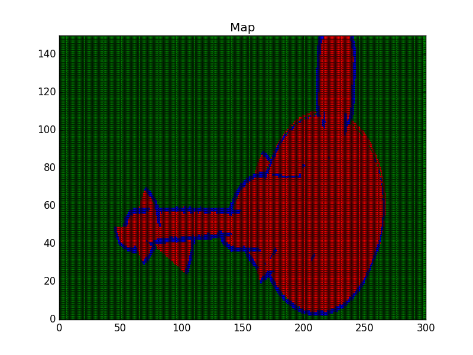

[](https://www.udacity.com/robotics)

# RoboND-OccupancyGridMappingAlgorithm
You will visualize the mapped environment through the generated image

### Instruction
Code the visualization function which will plot the state of each grid cell using the matplotlib python library
``` C++
void visualization()
{
    //TODO: Initialize a plot named Map of size 300x150
    
    //TODO: Loop over the log odds values of the cells and plot each cell state. 
    //Unkown state: green color, occupied state: black color, and free state: red color 
    
    //TODO: Save the image and close the plot 
}
```
Here are some helpful commands you can use to generate plots with the `matplotplusplus` library:
* *Set Title*: `std::string title("Map");`
               `auto h = matplot::figure(true);`
               `h->title(title);`
* *Set Limits*: `matplot::axis({xmin, xmax, ymin, ymax });`
* *Plot Data*:`matplot::plot({ x-value }, { y-value }, "Color and Shape");`
* *hold data*:` matplot::hold(matplot::on);;`
* *Save Plot*: `plt::save("File name and directory")`
* *show grid *: `matplot::grid(matplot::on);`
               `matplot::gca()->minor_grid(true);`
               `matplot::hold(matplot::off);`
* *save Plot*:   `matplot:: save("../Images/Map.jpg");`;

Check out this [link](https://github.com/alandefreitas/matplotplusplus) for more information on the `matplotlib` C++ library. For information regarding the plot color and shape refer to the LineSpec and LineColor section of the [MATLAB](https://www.mathworks.com/help/matlab/ref/plot.html?requestedDomain=true) documentation. 

### Compiling
```sh
## Basic Build Instructions

1. Clone this repo.
2. Make a build directory: `mkdir Debug && cd Debug`
3. Compile: `cmake .. && make` --> (Linuex OS) or `cmake .. -G "MinGW Makefiles" & mingw32-make` (windows)
```

### Running
```sh
$ ./robotND
```

Now, wait for the program to generate the map!

### Generated Map



